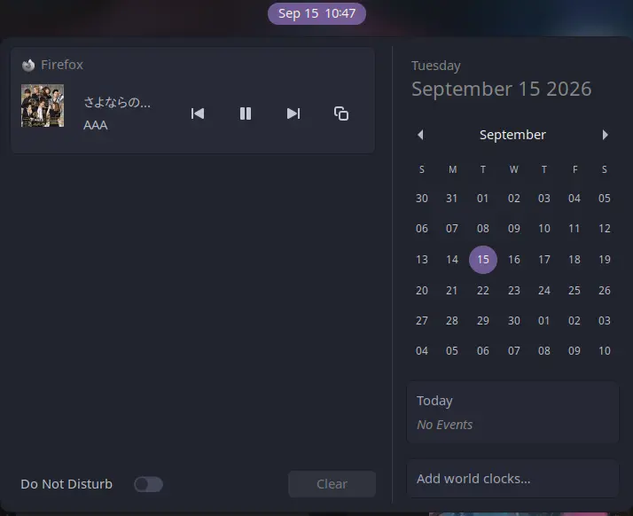

# Copy Now Playing

A GNOME Shell extension that adds a **Copy** button to GNOME's built-in media
player notification, letting you copy the currently playing track's artist
and title to your clipboard in one click.

Works with any MPRIS-compatible player: Spotify (web or desktop), browsers, and more.

## Features

- **Copy button** on the media notification, greyed out when nothing is playing.
  Copies to both the clipboard and the middle-click primary selection.
- **Keyboard shortcut** (`Super+Shift+C` by default) that copies the playing
  track from anywhere and shows what was copied on screen.
- **Configurable format** such as `{artist} - {title}`, `{title} - {artist}`,
  or your own template with `{artist}`, `{title}`, and `{album}`.
- **Optional Copy Link button** that copies the track's URL, for example a
  Spotify or YouTube link.

Open the preferences with `gnome-extensions prefs copy-now-playing@nyndow.github.io`
or from the Extensions app.



## Installation

```sh
git clone https://github.com/Nyndow/copy-now-playing.git
glib-compile-schemas copy-now-playing/copy-now-playing@nyndow.github.io/schemas
ln -s "$(pwd)/copy-now-playing/copy-now-playing@nyndow.github.io" \
      ~/.local/share/gnome-shell/extensions/copy-now-playing@nyndow.github.io
gnome-extensions enable copy-now-playing@nyndow.github.io
```

Reload GNOME Shell first if it doesn't show up: `Alt+F2` → `r` → `Enter`
(X11), or log out/in (Wayland).

Tested on GNOME Shell 45, 46, 47.

## How it works

See [CONTRIBUTING.md](CONTRIBUTING.md) for the internals.

## License

[GPL-2.0-or-later](LICENSE)
